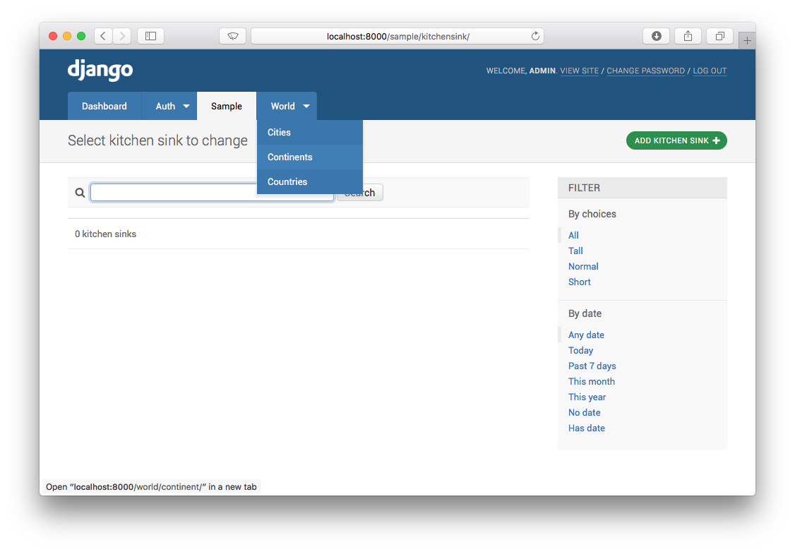
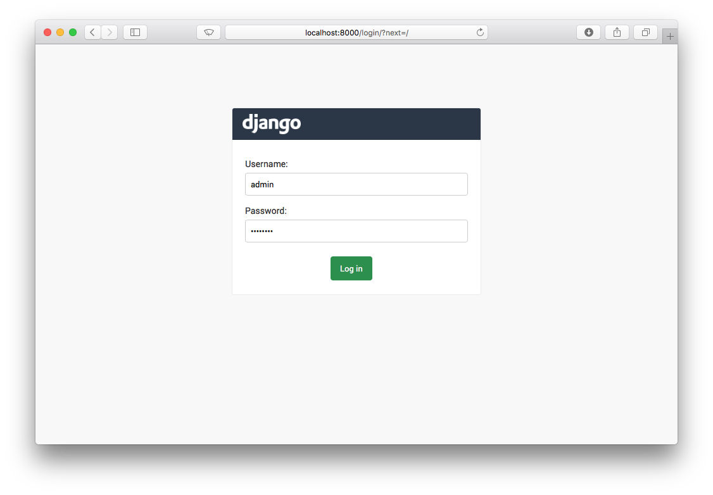
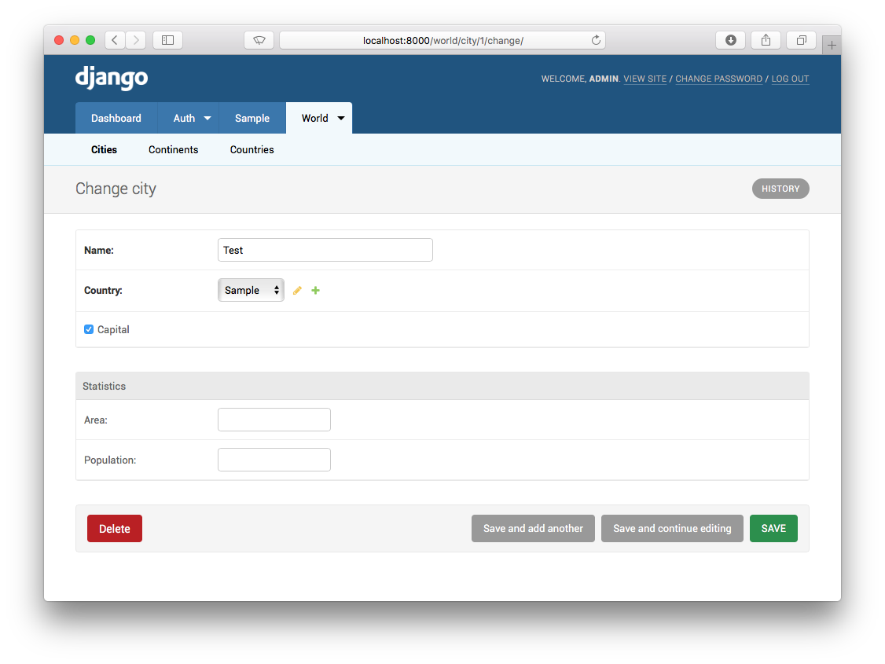
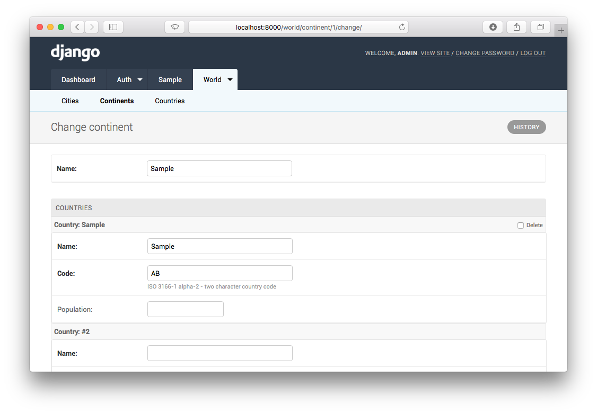
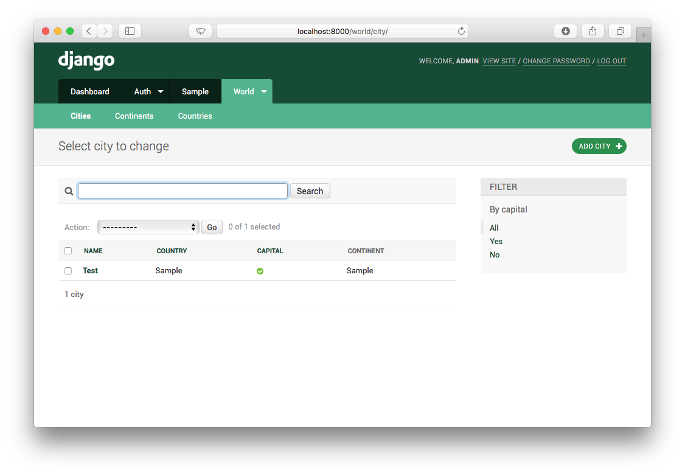
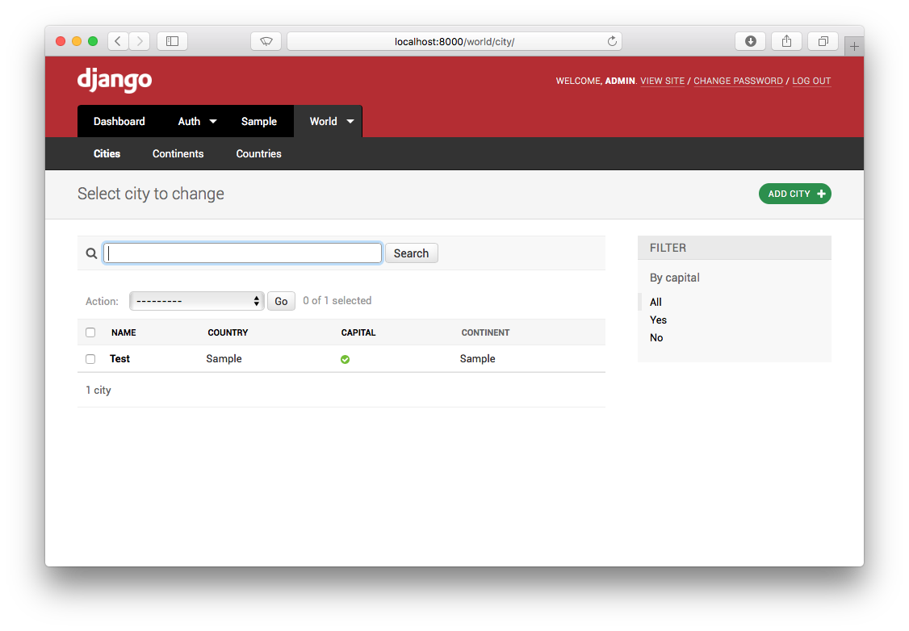

# Django Admin Menu Theme

An alternative theme for the Django admin that has a horizontal navigation bar with drop down menus for your models. Fully themeable from `settings.py`.



## Installation

Install the package:

```
pip install django-admin-menu
```

Then add `admin_menu` to your `INSTALLED_APPS` setting, **before `django.contrib.admin`** (or it wont work). For example:

```
INSTALLED_APPS = [
    'admin_menu',
    'django.contrib.admin',
    ...
]
```

## Settings

There are a couple of options you can adjust in your `settings.py` to influence the theme.

To adjust the logo, change:
```
ADMIN_LOGO = 'logo.png'
```

The logo is used in the top left of each page and on the login page.

You can adjust the order of the menu items with the `MENU_WEIGHT` setting:

```
MENU_WEIGHT = {
    'World': 20,
    'Auth': 4,
    'Sample': 5
}
```

Items with a higher weight will be pushed to the end of the menu. You don't have to fill in all the menu items, just the ones you would like to adjust the position of.

### ModelAdmin Settings

There are a few settings on your `ModelAdmin` class to adjust the menu:

```
class MyAdmin(admin.ModelAdmin):
    menu_title = "Users"
    menu_group = "Staff"
```

will change the title for this model to `Users` and place it on a drop down titled `Staff`.

You can use the same `menu_group` on multiple `ModelAdmin` classes and they will be grouped on the same menu.

## Screenshots





## Theming

To adjust the theme, you can add and edit these options in your project's `settings.py` file:

```
ADMIN_STYLE = {
    'primary-color': '#164B36',
    'secondary-color': '#092117',
    'tertiary-color': '#51B48E'
}
```

These variables are usually enough to add a brand flavour to the admin. There are other variables you can add, to change text colour etc. These are listed under Custom Theme.

### Dark Theme



Add to your settings.py:

```
ADMIN_STYLE = {
    'primary-color': '#2B3746',
    'secondary-color': '#354151',
    'tertiary-color': '#F2F9FC'
}
```

### Django Theme



Add to your settings.py:

```
ADMIN_STYLE = {
    'primary-color': '#164B36',
    'secondary-color': '#092117',
    'tertiary-color': '#51B48E'
}
```

### Red Theme



Add to your settings.py:

```
ADMIN_STYLE = {
    'primary-color': '#B42D33',
    'secondary-color': '#000000',
    'tertiary-color': '#333333'
}
```

### Custom Themes

You can customise the theme however you like, using these available variables:

```
ADMIN_STYLE = {
    'background': 'white',
    'primary-color': '#205280',
    'primary-text': '#d6d5d2',
    'secondary-color': '#3B75AD',
    'secondary-text': 'white',
    'tertiary-color': '#F2F9FC',
    'tertiary-text': 'black',
    'breadcrumb-color': 'whitesmoke',
    'breadcrumb-text': 'black',
    'focus-color': '#eaeaea',
    'focus-text': '#666',
    'primary-button': '#26904A',
    'primary-button-text':' white',
    'secondary-button': '#999',
    'secondary-button-text': 'white',
    'link-color': '#333',
    'link-color-hover': 'lighten($link-color, 20%)'
}
```

## History

#### [1.0] - 2016-12-05
First release, works.

#### [1.1] - 2016-12-16
Added theming support.

## License

MIT
